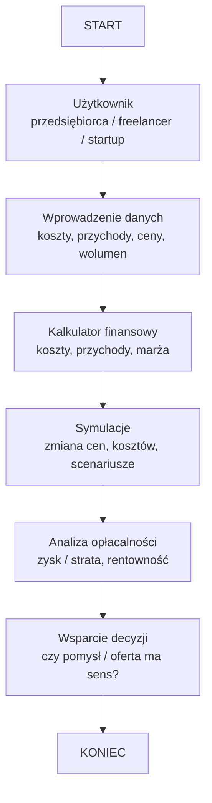

## Flowchart aplikacji

```mermaid
flowchart TD
    A[START] --> B[Użytkownik<br/>przedsiębiorca / freelancer / startup]
    B --> C[Wprowadzenie danych<br/>koszty, przychody, ceny, wolumen]
    C --> D[Kalkulator finansowy<br/>koszty, przychody, marża]
    D --> E[Symulacje<br/>zmiana cen, kosztów, scenariusze]
    E --> F[Analiza opłacalności<br/>zysk / strata, rentowność]
    F --> G[Wsparcie decyzji<br/>czy pomysł / oferta ma sens?]
    G --> H[KONIEC]
```